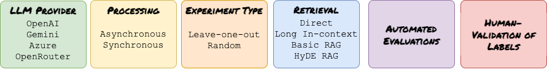

# KnowOrNot

KnowOrNot is an open-source framework that enables users to develop their own customized evaluation data and pipelines for evaluating out-of-knowledge base robustness, i.e. whether large language models (LLMs) can properly recognize the boundaries of their knowledge and abstain from answering when they don't know the answer.

## Highlights

Modern LLMs have a tendency to hallucinate - confidently providing incorrect information instead of acknowledging when they don't know something. KnowOrNot provides a systematic approach to:

1. Test if LLMs can identify what they do and don't know
2. Measure an LLM's propensity to hallucinate vs. abstain
3. Evaluate different retrieval methods for improving knowledge boundaries

## Installation

1. Create and activate a virtual environment.

```bash
python3 -m venv knowornot
source knowornot/bin/activate
```

2. Download the source code and enter the created source directory.
```bash
git clone git@github.com:govtech-responsibleai/KnowOrNot.git
cd knowornot
```

3. Install the library
```bash
uv pip install .
```

4. Set up environment variables in a `.env` file, depending on the LLM provider of choice.

## Quick Start


Refer to [quickstart.md](docs/quickstart.md) for more and the [example/quickstart_pipeline.py] for an end-to-end example flow.

## Key Features



### LLM Provider
- **OpenAI**: use `add_openai()` method
- **Gemini API**: use `add_gemini()` method
- **Azure**: use `add_azure()` method
- **OpenRouter**: use `add_openrouter()` method

### Processing of LLM responses
- **Asynchronous**: use `run_experiment_async`, `evaluate_experiment_async` method
- **Synchronous**: use `run_experiment`, `evaluate_experiment` method

### Experiment Types
- **Leave-one-out**: Remove a fact from the model's context and test if it can still answer correctly (measures memorization)
- **Random (Synthetic)**: Create questions the model shouldn't know based on provided context (tests abstention capability)

### Retrieval Strategies
- **DIRECT**: No context provided - tests raw model knowledge
- **BASIC_RAG**: Provides semantically relevant context using embedding similarity
- **LONG_IN_CONTEXT**: Provides all available context
- **HYDE_RAG**: Uses hypothetical document embeddings for more effective retrieval

### Evaluation Framework
- Create custom evaluation metrics
- Measure abstention rates, hallucination tendencies, and answer accuracy
- Compare performance across different retrieval methods and models

## Architecture

KnowOrNot consists of several integrated components:

1. **FactManager**: Extracts structured facts from documents
2. **QuestionExtractor**: Generates diverse question-answer pairs
3. **ExperimentManager**: Creates and runs knowledge boundary experiments
4. **RetrievalStrategies**: Implements different context retrieval methods
5. **Evaluator**: Assesses model responses with customizable metrics
